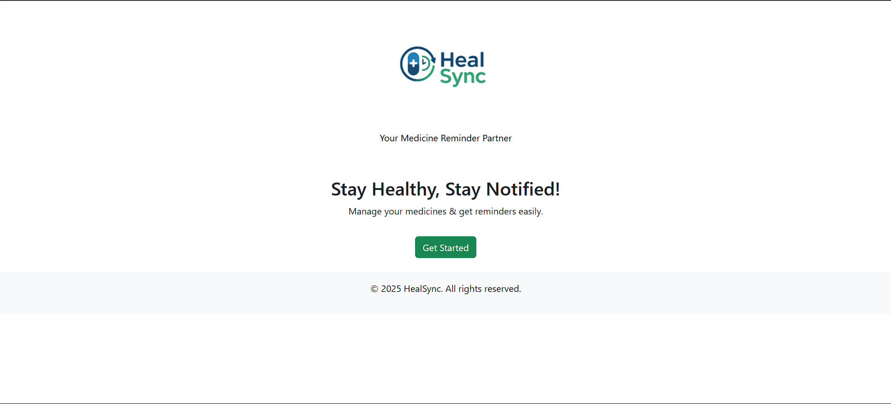
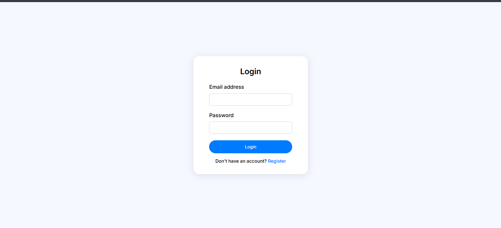
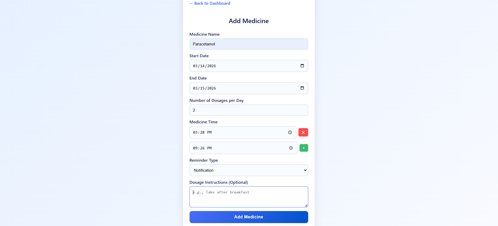
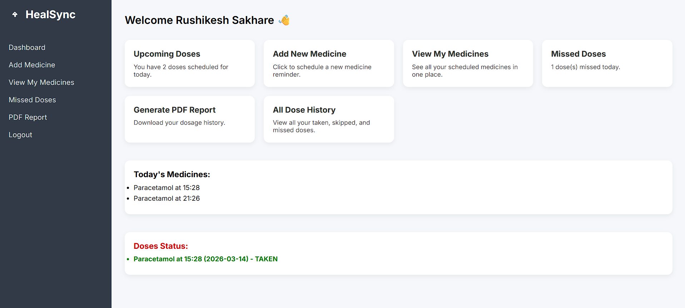
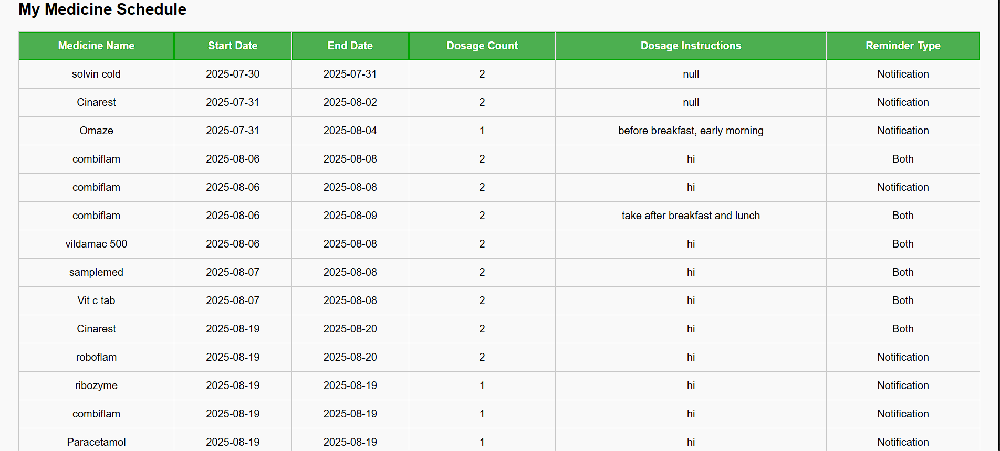
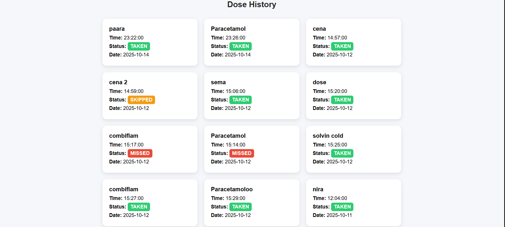
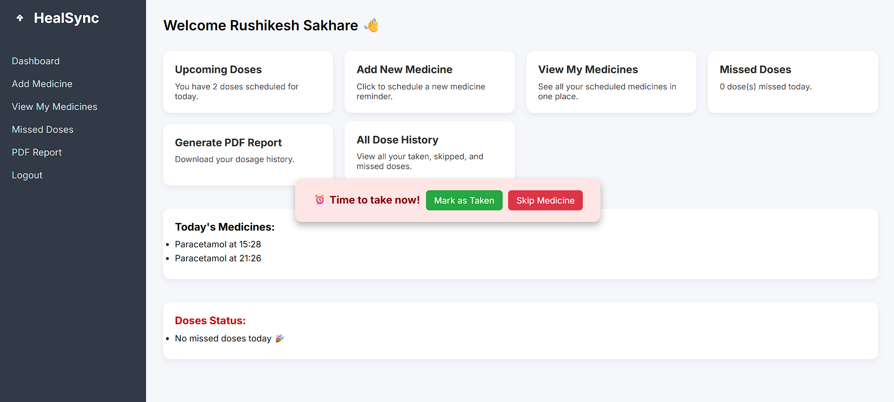
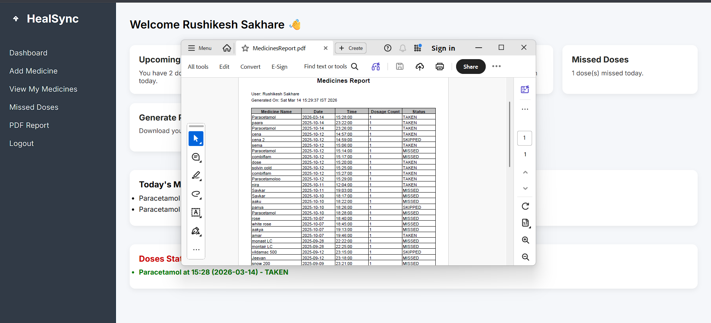

# HealSync – Medicine Reminder Application

HealSync is a desktop-based medicine reminder system designed to help users schedule medicines and receive timely reminders so they never miss a dose.

The system also tracks missed doses and generates reports to help monitor medicine adherence.

## Features

- User Registration and Login
- Add Medicines with Multiple Time Slots
- Daily Medicine Dashboard
- Alarm Reminder for Medicine Time
- Missed Dose Tracking
- PDF Report Generation
- Simple and user-friendly interface

## Technologies Used

- Backend: Java, Java Servlets, JSP
- Frontend: HTML, CSS, JavaScript
- Database: MySQL
- Server: Apache Tomcat
- Libraries: JSTL, iText PDF etc..

## Project Structure

healsync/
│
├── css/ # Stylesheets for UI design
├── images/ # Image assets
├── screenshots/ # Screenshots for README/demo
├── sounds/ # Alarm/notification sounds
│
├── database/ # Database-related files
│ └── database_schema.sql # Complete SQL schema
│
├── model/ # Java model classes (POJOs)
│ └── Medicine.java
│
├── src/
│ └── controller/ # Servlet controllers (business logic)
│ ├── AddMedicineServlet.java
│ ├── DashboardServlet.java
│ ├── DoseHistoryServlet.java
│ ├── DoseServlet.java
│ ├── LoginServlet.java
│ ├── LogoutServlet.java
│ ├── MyMedicinesServlet.java
│ ├── PdfReportServlet.java
│ └── RegisterServlet.java
│
├── web/
│ └── jsp/ # JSP files (dynamic views)
│ ├── dashboard.jsp
│ ├── doseHistory.jsp
│ └── my_medicines.jsp
│
├── WEB-INF/
│ ├── classes/ # Compiled Java classes
│ ├── lib/ # External libraries (JARs)
│ │ ├── itextpdf-5.5.13.3.jar
│ │ ├── jakarta.servlet.jsp.jstl-2.0.0.jar
│ │ ├── jakarta.servlet.jsp.jstl-api-2.0.0.jar
│ │ └── javax.servlet-api-4.0.1.jar
│ └── web.xml # Deployment descriptor
│
├── AddMedicine.html # Add medicine page
├── index.html # Landing page
├── login.html # Login page
├── register.html # Registration page
├── success.html # Success page
├── error.html # Error page
│
├── META-INF/ # Deployment metadata (auto-generated)
│
└── README.md # Project documentation

## 📸 Screenshots

### 🏠 Home Screen



### 🔐 Login Page



### 📝 Add Medicine Form



### 📊 Dashboard



### 💊 My Medicines



### 📜 Dose History



### 🔔 Notification Alarm



### 📄 PDF Report



## ⚙️ How to Run the Project

### 📌 Prerequisites

Make sure you have the following installed:

- Java JDK (8 or above)
- Apache Tomcat Server (v9 or above)
- MySQL Server
- Any IDE (VS Code / Eclipse / IntelliJ)

### 🗄️ Step 1: Setup Database

1. Open MySQL
2. Create database:

   ```sql
   CREATE DATABASE healsync_db;
   USE healsync_db;
   ```

3. Run the schema file:

   ```sql
   SOURCE database/database_schema.sql;
   ```

### ⚙️ Step 2: Configure Apache Tomcat Server

Download Apache Tomcat from:
https://tomcat.apache.org/

- Extract the zip file

- Go to the bin folder and run:
  startup.bat (Windows)

- Open browser and verify:
  http://localhost:8080

If Tomcat is running, you will see the Tomcat homepage ✅

### 🔗 Step 3: Configure Project in Tomcat

Option 1: Manual Deployment (Recommended)

- Copy your project folder HEALSYNC
- Rename it to: "healsync"
- Place it inside Tomcat directory: apache-tomcat/webapps/
- Make sure structure looks like: webapps/healsync/

▶️ Step 4: Start the Server

- Go to: apache-tomcat/bin/
- Run: startup.bat

🌐 Step 5: Run the Application

Open browser and go to: http://localhost:8080/healsync or http://localhost:8080/healsync/index.html

## ⚙️ Deployment Using WAR File

This method uses a **WAR (Web Application Archive)** file, which is the standard way of deploying Java web applications.

### 📦 Step 1: Create WAR File

#### 👉 Method 1: Using IDE (Recommended)

- Right-click on project
- Select **Export → WAR file**
- Save as: "healsync.war"

#### 👉 Method 2: Manual (Without IDE)

- Ensure your project structure is correct
- Compress the project folder
- Rename the file:
- healsync.zip → healsync.war

### 📂 Step 2: Deploy WAR File in Tomcat

- Copy the WAR file
- Paste it into: apache-tomcat/webapps/

### ▶️ Step 3: Start Tomcat Server

- Go to: apache-tomcat/bin/
- Run: startup.bat

### ⚡ Step 4: Automatic Deployment

- Tomcat will automatically extract the WAR file
- A folder will be created: webapps/healsync/

### 🌐 Step 5: Run the Application

Open your browser and visit: http://localhost:8080/healsync or http://localhost:8080/healsync/index.html

## 🎯 Conclusion

HealSync is a complete medicine reminder system that helps users manage their daily medication schedules efficiently. It ensures timely reminders, tracks missed doses, and provides useful reports for better health monitoring.

The project demonstrates the implementation of a full-stack web application using Java Servlets, JSP, and MySQL, following the MVC architecture. It also highlights key concepts such as database design, backend logic handling, and user-friendly interface development.

Overall, HealSync serves as a practical solution to improve medicine adherence and showcases strong fundamentals in web application development.
